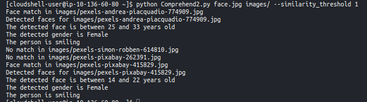

**Task 3.1: Introduction to AWS IAM**

Permissions are managed by policies that can be assigned to users or user groups (users can be assigned to groups). One group can have multiple policies.

Permission policies are very flexible, defined by a json, there are predefined ones named "Managed Policy" with common configurations from AWS or defined by admins but you can even define a custom policy for a single user with an "Inline Policy".

You can add users to groups both from the groups page or from the user page.

I'm guessing the high level of detail might require a lot of back and forth to reconfigure, add missing permissions and such after starting to work on the projects.

**Task 3.2: Build your VPC and Launch a Web Server**

With the VPC service, AWS offers methods to create network environments isolated from other systems inside the cloud or from the internet. There are many settings and I'm not fluent with all the networks configurations and options available but It seems that anyone can create simple setups with the VPC Whizard.

Inside these VPC we can create public or private subnets with IP ranges.
And to expose resources to the public internet we have to use gateways for example to be able to connect to EC2 instances.

**Task 3.3: Introduction to Amazon EC2**

With EC2 is an IaaS that can be used to create machine instances. When we create the machine we have to select an image (AMI) that defines the OS and some applications already installed and also the instance type with harware presets, there are hundreds of instance types to choose from, they are organized in families an sizes with more or less CPU cores etc.

When creating we also define the keys to use the SSH login later and the VPC, subnets etc. We can also choose the storage size, termination or stopping protections to prevent the accidental termination of a machine and losing the disc information for example. And finally we can add a bash script for custom setup to install some libraries etc.

After creating the machine we still have the option to resize the volumes and even change the instance type.

**Task 3.4/3.5**

For the task 3.5 we had to use AWS rekognition instead of AWS comprehend. AWS rekognition has plenty of different methods for analysis, comparison, and describing of images. However, most of the methods it has are related to humans and specifically to facial images. That is why we decided to use methods related to people as there are more of those available.The most time demanding task was going through each available method and reading its required inputs and what are its outputs. After that we decided to build a small program utilizing 2 methodscompare_faces and detect_faces. Firstly, the program compares the given face image to all other face images available. 
Compare_faces also requires similarity_threshold value which decides how strict comparison must be. 
By default, it is set to 80 but it can be changed by user if he wants the comparison to be less strict. 
For each image that has been matched, meaning its similiraty_threshold is higher, we provide 4 outputs which are age_range, gender, smile, and eyeglasses. 

We also tried detect_labels method in the much simpler version of code called Comprehend1.py. The method has many different outputs that could be used in a variety of tasks but it seemed unnecessary in our case.

> How long have you been working on this session? What have been the main difficulties you have faced and how have you solved them?

I have been working on this session around 6 hours in total with all the Amazon Labs and tasks.
The main difficulties have been in the use of the AWS Rekognition API. We had to search through the documentation to find the response formats and some python code. Also because we used the CloudShell instead of a local setup or an EC2 instance it was a bit inconvenient to debug with the shell. To solve this we used a local IDE to write the code and then replaced the script to test in the shell besides making small changes directly with nano inside the shell.
